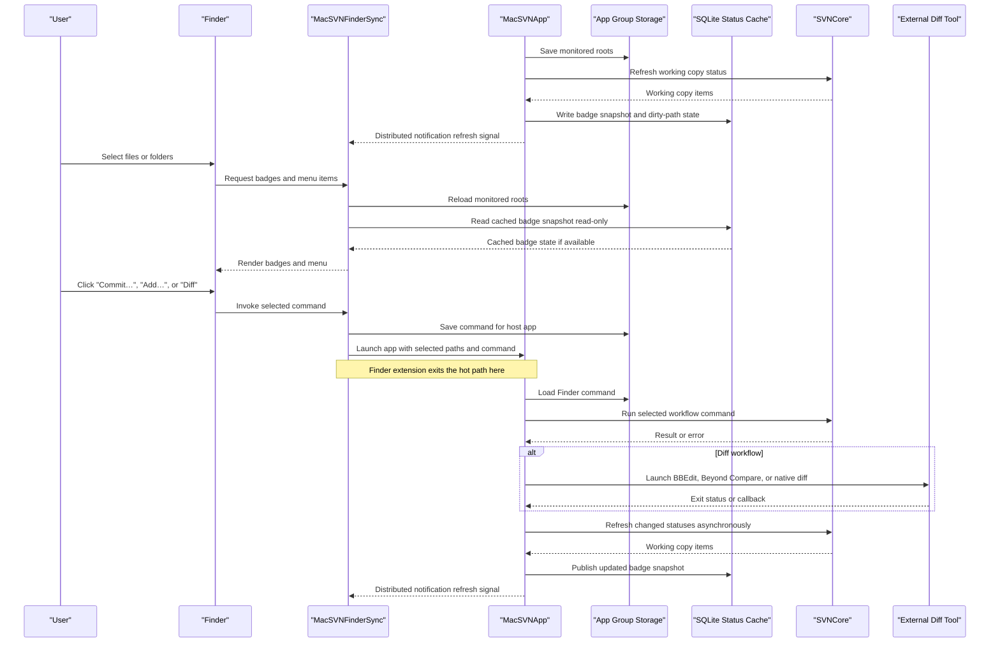
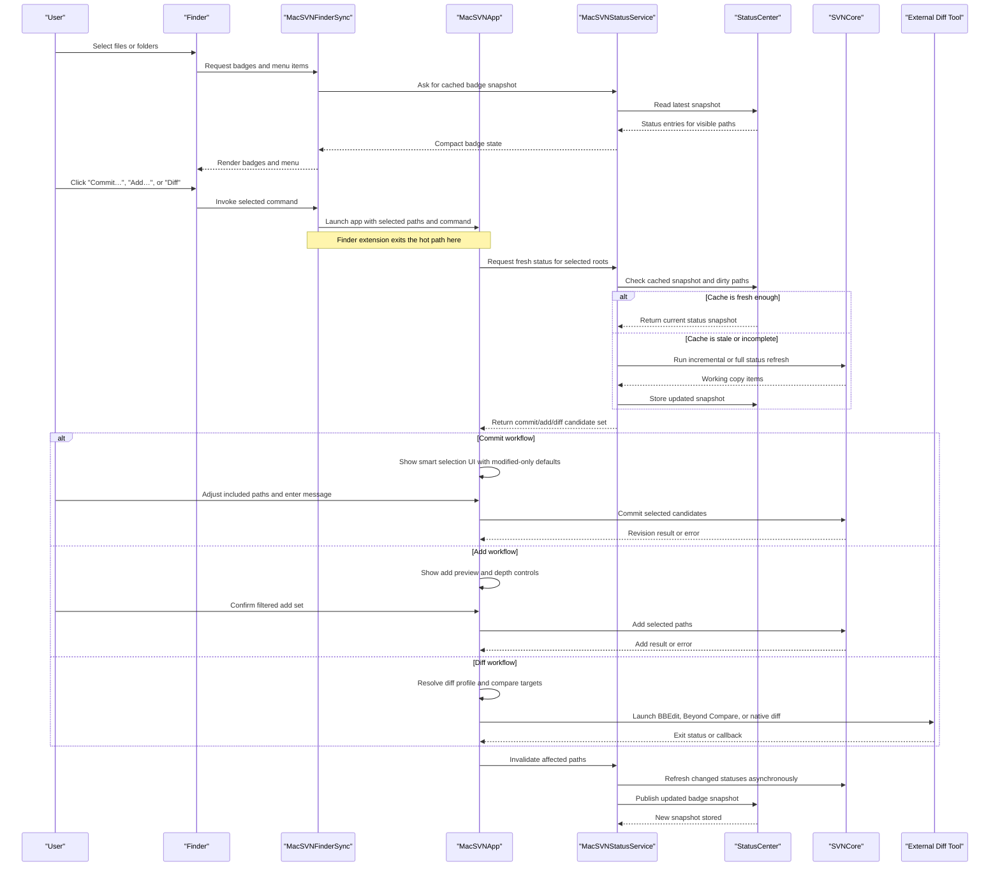

# Architecture

## Goal

Build a native macOS SVN client that follows the same broad module split as TortoiseSVN, but is designed around macOS process boundaries and the performance/stability gaps seen in current competitors.

## Upstream to macOS mapping

| Upstream module | Current role in TortoiseSVN | Proposed macOS counterpart |
| --- | --- | --- |
| `TortoiseProc` | Main UI, command dispatch, dialogs | `MacSVNApp` plus `CommitKit` and shared workflow coordinators |
| `TortoiseShell` | Explorer context menu, overlays, property pages | `MacSVNFinderSync` plus `MacSVNQuickActions` fallback |
| `TSVNCache` | Status cache, directory watching, shell update signaling | `MacSVNStatusService` plus `StatusCenter` |
| `SVN` | Client wrapper for Subversion APIs | `SVNCore` |
| `TortoiseMerge` | Diff and merge UI | external tool bridge first, native diff UI later |
| `SubWCRev` | Working copy revision substitution tool | future `mtsvn subwcrev` CLI command |
| `IBugTraqProvider` | Issue tracker provider interface | future plugin API for issue tracker integrations |

## Process model

### 1. `MacSVNApp`

Responsibilities:

- standalone client for commit, update, log, browse, diff, merge, shelve, and settings
- main settings surface for external tools, backend choice, timestamp policy, and performance controls
- the only place with heavyweight workflow UI

Why:

- Finder-only interaction is too limiting on macOS
- complex commit/add workflows are easier to deliver in a dedicated app than inside a Finder extension

### 2. `MacSVNFinderSync`

Responsibilities:

- request badge state for visible paths
- expose a minimal context menu
- hand off long-running actions to the app or status service

Rules:

- no recursive `svn status` inside the extension
- no long-lived in-memory working copy model
- no direct diff/merge orchestration

### 3. `MacSVNQuickActions`

Responsibilities:

- fallback action surface for macOS versions where Finder Sync menus are unreliable
- keep critical commands available on newer macOS releases even when Finder integration shifts

### 4. `MacSVNStatusService`

Responsibilities:

- own FSEvents watchers
- maintain a persistent status index
- batch invalidations and refresh requests
- publish badge snapshots to Finder Sync
- isolate large refresh work from Finder and the main app

Why:

- existing competitors suffer when every badge refresh triggers a large scan
- daemonizing the status pipeline is the main defense against Finder stalls, RAM spikes, and crash amplification

Current scaffold status:

- `StatusServiceHost` now exists in the Swift package as the first service-layer host
- `SQLiteStatusCacheStore` now persists badge snapshots and dirty-path state
- `FSEventsWorkingCopyWatcher` now feeds real file-system events into that host
- this is still an in-package host, not the deployed app/extension-facing XPC data path
- the next step is promoting that host into the actual app/extension-facing background process boundary

## Shared modules

### `CoreTypes`

Shared domain models for working copy items, repository roots, commit candidates, and badge snapshots.

### `SVNCore`

Backend abstraction for:

- bundled `libsvn`
- external `svn` command-line tools
- future compatibility adapters for Xcode-bundled Subversion variants

This split matters because backend mismatch is a recurring macOS pain point.

In the current phase-one implementation, the first real backend work is moving into the Rust workspace under `rust/`, with `svn_backend` wrapping the command-line `svn` tool.

### `StatusCenter`

Shared cache-facing status logic with the following rules:

- stale data is acceptable for badges for a short window
- hot cache reads must be fast and memory-bounded
- full rescans must be scheduled, cancellable, and deduplicated
- dirty paths should be refreshed incrementally whenever possible

### `CommitKit`

Shared workflows for:

- smart partial commit selection
- add preview and depth control
- shelve and unshelve orchestration
- commit validation and warnings

### `IntegrationKit`

Shared integration contracts for:

- Finder menu items
- external diff and merge tool profiles
- timestamp preservation policy

## Data flow

1. FSEvents mark paths or working copy roots dirty.
2. `MacSVNStatusService` batches and coalesces refresh work.
3. `StatusCenter` asks `SVNCore` for an updated status view.
4. A compact badge snapshot is stored and published to `MacSVNFinderSync`.
5. Finder Sync renders the cached result immediately.
6. `MacSVNApp` uses the same status and command pipeline for commit, add, diff, shelve, and update workflows.

## Current FinderSync data path

The current FinderSync extension does not fetch badge state by directly connecting to `MacSVNStatusService` or `StatusService.xpc`.

Today, FinderSync reads badge snapshots from the App Group SQLite cache and relies on distributed notifications only as refresh signals. Notification payloads are not trusted as a source of monitored roots; FinderSync reloads roots from App Group storage after a signal arrives. The main app/service-side code is responsible for writing snapshots and dirty-path updates.

## Current sequence: SQLite shared cache

## Target sequence: XPC status service

The target process architecture promotes the current service host into an authenticated app/extension-facing boundary. In that model, FinderSync can ask the service for small cached payloads, while the service owns refresh scheduling and cache writes.

### What these sequences protect us from

- Finder never owns the commit tree, add preview, diff setup, or long-running SVN calls.
- The extension only handles fast badge reads and command forwarding.
- Status refresh is centralized, deduplicated, and reusable across Finder and the standalone app.
- Big repositories affect the background service, not Finder responsiveness directly.

## Performance and stability decisions

### Finder work must be constant-time

Badges and context menu preparation should read from a shared cache or a small XPC payload. Finder surfaces should never perform deep repository scans.

### Background refresh must be incremental

Use dirty-root queues and changed-path batches so large repositories do not repeatedly pay for global rescans.

### Memory must be explicitly budgeted

The status service should:

- limit concurrent roots under refresh
- evict cold snapshots
- stream status results instead of materializing every path at once when possible

### Large operations must be cancelable

Commit, update, and add workflows must expose progress and cancellation. Big commits should execute in an operation coordinator rather than blocking the UI thread.

### Crash isolation matters

Finder integration, background refresh, and workflow UI should not all live in one process. XPC boundaries reduce the blast radius of leaks and crashes.

## Feature expectations from day one

- standalone client outside Finder
- partial commit selection with modified-only defaults
- add preview before recursive directory adds
- shelve and unshelve support
- built-in profiles for BBEdit and Beyond Compare
- timestamp preservation controls
- no artificial single-working-copy limit

## Delivery order

1. Build the shared domain and backend abstraction.
2. Ship the phase-one Rust backend around command-line `svn` and connect it to the status service.
3. Ship the status service and standalone commit workflow.
4. Add Finder Sync and Quick Actions on top of the same shared services.
5. Add shelve, native diff UI, repository browser, and plugin integration.
